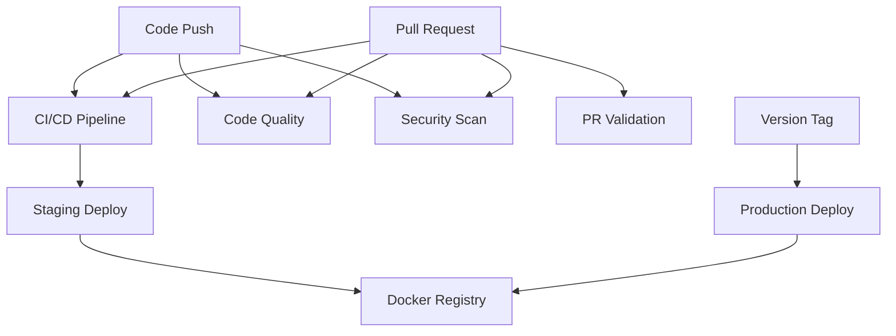

# 🚀 GitHub Actions CI/CD Implementation

## Overview

Comprehensive GitHub Actions workflows have been implemented to provide enterprise-level CI/CD capabilities including automated testing, security scanning, code quality checks, and deployment pipelines.

## 📋 Workflows Implemented

### 1. 🧪 **Main CI/CD Pipeline** (`ci.yml`)
**Triggers:** Push to `main`/`develop`, Pull Requests  
**Features:**
- **Multi-version testing**: Node.js 18.x, 20.x, 22.x
- **Build verification**: TypeScript compilation
- **Test execution**: Full test suite with coverage
- **Docker builds**: Container image testing
- **Performance checks**: API response time validation
- **Coverage reporting**: Codecov integration

### 2. 📊 **Code Quality** (`code-quality.yml`)
**Triggers:** Push to `main`/`develop`, Pull Requests  
**Features:**
- **Code formatting**: Prettier validation
- **Linting**: ESLint code style checks
- **TypeScript**: Type checking validation
- **Dependency analysis**: Bundle size tracking
- **Code metrics**: Complexity and statistics
- **License compliance**: Dependency license checking

### 3. 🔒 **Security Scanning** (`security.yml`)
**Triggers:** Push, PR, Weekly schedule (Mondays 9 AM UTC)  
**Features:**
- **Vulnerability scanning**: NPM audit with severity levels
- **Static analysis**: GitHub CodeQL security scanning
- **Secret detection**: TruffleHog credential scanning
- **Dependency review**: GitHub dependency review for PRs
- **Container security**: Trivy Docker image scanning
- **SARIF reporting**: Security results uploaded to GitHub

### 4. 🔍 **PR Validation** (`pr-validation.yml`)
**Triggers:** Pull Request events  
**Features:**
- **Change impact analysis**: File diff and statistics
- **Bundle size comparison**: Performance impact tracking
- **Breaking change detection**: API/model modification alerts
- **Test coverage impact**: Coverage comparison
- **PR quality checks**: Title conventions, size validation
- **Comprehensive reporting**: Detailed change summaries

### 5. 🌍 **Deployment** (`deploy.yml`)
**Triggers:** Push to `main`, Version tags (`v*`), Manual dispatch  
**Features:**
- **Staging deployment**: Auto-deploy from `main` branch
- **Production deployment**: Version-tagged releases
- **Docker registry**: GitHub Container Registry (GHCR)
- **Environment protection**: Staging/Production environments
- **Release automation**: GitHub releases for version tags
- **Manual deployment**: Workflow dispatch with environment selection

## 🐳 Docker Integration

### Dockerfile Features:
- **Multi-stage build**: Optimized production image
- **Security hardening**: Non-root user, minimal attack surface
- **Health checks**: Built-in container health monitoring
- **Production-ready**: Alpine Linux base, minimal dependencies

### .dockerignore Optimization:
- Excludes development files and tests
- Reduces build context size
- Improves build performance

## 📈 Quality Metrics & Badges

Status badges added to README.md:
- [](workflow-url) - Build and test status
- [](workflow-url) - Code quality checks
- [](workflow-url) - Security scanning status  
- [](workflow-url) - Deployment status

## 🔧 Local Development Commands

All CI checks can be run locally:

```bash
# Core quality checks (same as CI)
npm run typecheck    # TypeScript type checking
npm run build       # Application build
npm test            # Test suite execution
npm run lint        # Code style validation
npm audit           # Security vulnerability scan

# Additional checks
npm run test:coverage    # Test coverage report
npm run format:check    # Code formatting validation
npm run format         # Auto-format code
```

## 🎯 Environment Configuration

### Staging Environment
- **Trigger**: Push to `main` branch
- **URL**: https://staging.neo-financial-demo.com
- **Auto-deployment**: Enabled
- **Environment protection**: None

### Production Environment  
- **Trigger**: Version tags (`v*`) or manual dispatch
- **URL**: https://neo-financial-demo.com
- **Auto-deployment**: Tag-based only
- **Environment protection**: Manual approval required

## 🚦 Workflow Dependencies



## 📊 Performance & Efficiency

### Caching Strategy:
- **NPM dependencies**: Cached using `actions/setup-node@v4`
- **Docker layers**: Build cache using GitHub Actions cache
- **TypeScript compilation**: Incremental builds where possible

### Parallel Execution:
- **Matrix builds**: Node.js versions run in parallel
- **Independent workflows**: Quality, security, and CI run concurrently
- **Job parallelization**: Multiple checks within workflows

## 🔒 Security Best Practices

### Secrets Management:
- `GITHUB_TOKEN`: Automatic token for repository access
- `CODECOV_TOKEN`: Optional for coverage reporting (secrets)
- Container registry authentication via GitHub token

### Security Scanning Schedule:
- **On every push**: Quick security checks
- **Weekly deep scan**: Comprehensive vulnerability audit
- **PR dependency review**: New dependency security validation

## ⚡ Quick Start

1. **Push to repository**: All workflows trigger automatically
2. **Create pull request**: PR validation runs comprehensive checks
3. **Merge to main**: Staging deployment triggers automatically  
4. **Create version tag**: Production deployment with release automation

```bash
# Create and push a version tag for production deployment
git tag v1.0.0
git push origin v1.0.0
```

## 🎉 Benefits Achieved

### For Developers:
- **Immediate feedback**: PR checks catch issues early
- **Consistent quality**: Automated code style and formatting
- **Security awareness**: Vulnerability detection and reporting
- **Performance tracking**: Bundle size and performance monitoring

### For Operations:
- **Automated deployment**: Hands-off staging deployments
- **Environment protection**: Production deployment controls
- **Container registry**: Versioned Docker images
- **Release automation**: Consistent release process

### For Business:
- **Quality assurance**: Comprehensive testing and validation
- **Security compliance**: Regular scans and dependency monitoring  
- **Deployment confidence**: Automated testing before deployment
- **Audit trail**: Complete deployment and change history

## 🚀 Production Readiness

This CI/CD pipeline provides enterprise-level automation suitable for production workloads with:

- ✅ **Multi-environment deployments** (staging/production)
- ✅ **Security scanning and compliance**
- ✅ **Quality gates and validation**
- ✅ **Container orchestration ready**
- ✅ **Monitoring and observability integration points**
- ✅ **Rollback capabilities** (via container image tags)
- ✅ **Manual deployment controls** for production